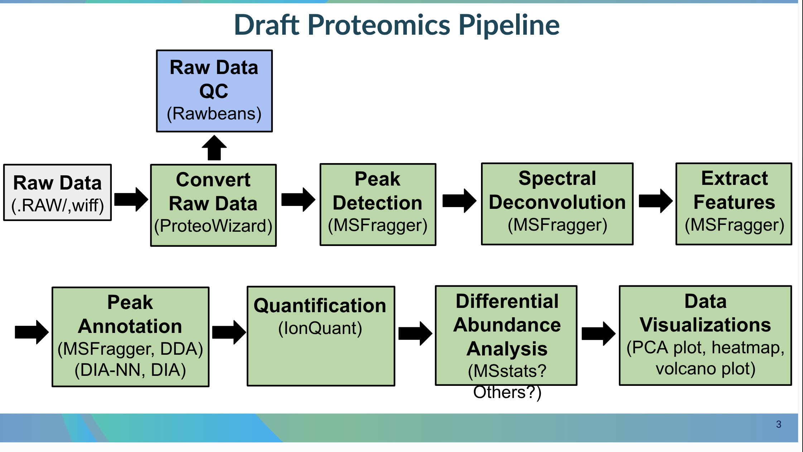

# GeneLab bioinformatics processing pipeline for Mass Spectrometry-based Proteomics Data (LFQ-MBR Workflow)

> **This page holds an overview and instructions for how GeneLab processes mass spectrometry-based proteomics data using the LFQ-MBR (Label-Free Quantification with Match-Between-Runs) workflow. Exact processing commands, GL-DPPD-[LFQ-MBR] version used, and processed data output files for specific datasets are provided in the [Open Science Data Repository (OSDR)](https://osdr.nasa.gov/bio/repo/).**  

---

**Date:** January X, 2026  
**Revision:** A  
**Document Number:** GL-DPPD-[LFQ-MBR]-A  

**Submitted by:**  
Alexis Torres (GeneLab Data Processing Team)  

**Approved by:**  
X (X)

---

# Table of contents  

- [**Software used**](#software-used)
- [**General processing overview with example commands**](#general-processing-overview-with-example-commands)
  - [**1. Raw Data QC**](#1-raw-data-qc)
    - [1a. RawBeans QC (Samplewise)](#1a-rawbeans-qc-samplewise)
    - [1b. RawBeans QC (All Samples)](#1b-rawbeans-qc-all-samples)
  - [**2. Create Proteome FASTA Database**](#2-create-proteome-fasta-database)
    - [2a. Download Proteome from UniProt](#2a-download-proteome-from-uniprot)
    - [2b. Add Decoys and Contaminants to FASTA](#2b-add-decoys-and-contaminants-to-fasta)
  - [**3. FragPipe Processing Pipeline**](#3-fragpipe-processing-pipeline)
    - [3a. Launch FragPipe](#3a-launch-fragpipe)
    - [3b. Check Spectral Files Centroid Status](#3b-check-spectral-files-centroid-status)
    - [3c. Initialize Workspace](#3c-initialize-workspace)
    - [3d. MSFragger Database Search](#3d-msfragger-database-search)
    - [3e. MSBooster Deep Learning Feature Addition](#3e-msbooster-deep-learning-feature-addition)
    - [3f. Percolator PSM Rescoring and Statistical Validation](#3f-percolator-psm-rescoring-and-statistical-validation)
      - [3f.1. Add Percolator Validation Information to pepXML](#3f1-add-percolator-validation-information-to-pepxml)
    - [3g. ProteinProphet Protein Inference and Statistical Validation](#3g-proteinprophet-protein-inference-and-statistical-validation)
    - [3h. Database Annotation](#3h-database-annotation)
    - [3i. Filter Results by FDR](#3i-filter-results-by-fdr)
    - [3j. Generate Reports](#3j-generate-reports)
    - [3k. IonQuant Label-Free Quantification](#3k-ionquant-label-free-quantification)
  - [**4. MSstats Differential Abundance Analysis**](#4-msstats-differential-abundance-analysis)

---

# Software used  

|Program|Version|Relevant Links|
|:------|:------:|:-------------|
|dp_tools|1.3.9|[https://github.com/torres-alexis/dp_tools](https://github.com/torres-alexis/dp_tools)|
|rawBeans|1.6.4|[https://github.com/torres-alexis/rawBeans](https://github.com/torres-alexis/rawBeans)|
|FragPipe|23.1|[https://fragpipe.nesvilab.org/](https://fragpipe.nesvilab.org/)|
|BatMass|1.35.4|[https://batmass.org/](https://batmass.org/)|
|MSFragger|4.3|[http://msfragger-upgrader.nesvilab.org/upgrader/](http://msfragger-upgrader.nesvilab.org/upgrader/)|
|MSBooster|1.3.17|[https://github.com/Nesvilab/MSBooster](https://github.com/Nesvilab/MSBooster)|
|DIA-NN|1.8.2 Beta 8|[https://github.com/vdemichev/DiaNN](https://github.com/vdemichev/DiaNN)|
|Percolator|3.7.1|[https://github.com/percolator/percolator](https://github.com/percolator/percolator)|
|Philosopher|5.1.2|[https://github.com/Nesvilab/philosopher/releases/latest](https://github.com/Nesvilab/philosopher/releases/latest)|
|IonQuant|1.11.11|[https://github.com/Nesvilab/IonQuant/releases/latest](https://github.com/Nesvilab/IonQuant/releases/latest)|
|MSstats|4.18.0|[https://www.bioconductor.org/packages/release/bioc/html/MSstats.html](https://www.bioconductor.org/packages/release/bioc/html/MSstats.html)|


---

# General processing overview with example commands  



> Exact processing commands and output files listed in **bold** below are included with each relevant mass spectrometry-based proteomics processed dataset in the [Open Science Data Repository (OSDR)](https://osdr.nasa.gov/bio/repo/). 

---

## 1. Raw Data QC  

### 1a. RawBeans QC (Samplewise)

```bash
create-qc-report.py \
  --input *.mzML \
  --output-dir . \
  --batch \
  --cores NumberOfThreads

cd *
zip -r ../*-report.zip qc-report.html resources/
cd ..
```

**Parameter Definitions:**

- `--input` – one mzML file path
- `--output-dir` – the output directory to store results
- `--batch` – process file in batch mode (creates subdirectory for output)
- `--cores` – number of CPU cores to use for processing

**Input Data:**

- `*.mzML` (input mass spectrometry raw data in mzML format)

**Output Data:**

- \*/qc-report.html (RawBeans QC report HTML file)
- \*/resources/ (directory containing supporting files for the QC report HTML)
- **\*_qc-report.zip** (zip archive containing qc-report.html and resources/ folder)

<br>

### 1b. RawBeans QC (All Samples)

```bash
create-qc-report.py \
  --input sample1.mzML sample2.mzML \
  --output-dir . \
  --cores NumberOfThreads

zip -r All_GLProteomics_qc-report.zip qc-report.html resources/
```

**Parameter Definitions:**

- `--input` – multiple mzML files provided as individual paths separated by spaces
- `--output-dir` – the output directory to store results
- `--cores` – number of CPU cores to use for processing

**Input Data:**

- `*.mzML` (input mass spectrometry raw data in mzML format)

**Output Data:**

- qc-report.html (RawBeans QC report HTML file for all samples)
- resources/ (directory containing supporting files for the QC report HTML)
- **All_GLProteomics_qc-report.zip** (zip archive containing qc-report.html and resources/ folder for all samples combined)

<br>

---

## 2. Download Reference Proteome, Add Decoys and Contaminants to FASTA

```bash
  philosopher database \
    --id UPXXXXXXXXX \
    --reviewed \
    --contam
```
**Parameter Definitions:**

- `--id` – UniProt proteome ID (e.g., UP000059680)
- `--reviewed` – restrict to reviewed (Swiss-Prot) proteome entries
- `--contam` – add 116 common contaminant proteins to the FASTA database (see [Philosopher Database Wiki](https://github.com/Nesvilab/philosopher/wiki/Database))

**Output Data:**

- \*-decoys-reviewed-contam-*.fas (FASTA database containing the proteome with reversed decoy sequences and common contaminants added)

<br>

---

## 3. FragPipe Processing Pipeline

### 3a. Launch FragPipe

```bash
fragpipe \
  --headless \
  --workflow LFQ-MBR.workflow \
  --manifest manifest.tsv \
  --workdir . \
  --config-tools-folder tools_folder \
  --config-python /usr/bin/python3.11
```

**Parameter Definitions:**

- `--headless` – run FragPipe in headless mode (no GUI)
- `--workflow` – path to FragPipe workflow configuration file
- `--manifest` – path to manifest TSV file containing sample information
- `--workdir` – working directory for FragPipe execution
- `--config-tools-folder` – path to folder containing FragPipe tools not included in the Docker image (e.g., MSFragger, IonQuant, diaTracer JAR files)
- `--config-python` – path to Python executable

**Input Data:**

- `LFQ-MBR.workflow` (FragPipe LFQ-MBR workflow configuration file)
- `manifest.tsv` (manifest file with sample information and file paths)
- `tools_folder/` (directory containing FragPipe tools not included in the Docker image)
- `*.mzML` (input mass spectrometry raw data in mzML format)
- `*-decoys-reviewed-contam-*.fas` (proteome FASTA database with decoys and contaminants, output from [Step 2](#2-create-proteome-fasta-database))

**Output Data:**

- `fragger.params` (MSFragger parameter configuration file)
- `msbooster_params.txt` (MSBooster parameter configuration file)
- `filelist_proteinprophet.txt` (list of interact.pep.xml files to be passed to ProteinProphet)
- `filelist_ionquant.txt` (file list for IonQuant)
- `modmasses_ionquant.txt` (modification masses file for IonQuant)
- `experiment_annotation.tsv` (experiment annotation file)
- `fragpipe.workflow` (updated FragPipe workflow configuration file)
- `fragpipe-files.fp-manifest` (FragPipe files manifest)
- `fragpipe.job` (FragPipe job configuration file)
- `log_*.txt` (FragPipe execution log file with timestamp)
- `sdrf.tsv` (Sample and Data Relationship Format file)

<!-- > **Note:** FragPipe generates these configuration files during launch to configure and orchestrate all subsequent Fragpipe processing steps. These files contain parameters, file lists, and workflow settings used by the various tools in the pipeline. -->

<br>

### 3b. Check Spectral Files Centroid Status

```bash
java -Xmx55G -cp /fragpipe_bin/fragpipe-23.1/fragpipe-23.1/lib/fragpipe-23.1.jar:/fragpipe_bin/fragpipe-23.1/fragpipe-23.1/tools/batmass-io-1.35.4.jar org.nesvilab.fragpipe.util.CheckCentroid *.mzML 31
```
<!-- CLI mode (backup) - same command, no changes needed for headless mode -->

**Parameter Definitions:**

- `-Xmx55G` – Java memory limit (e.g., `-Xmx55G` for 55 GB RAM)
- `-cp` – Java classpath to FragPipe and BatMass libraries
- `org.nesvilab.fragpipe.util.CheckCentroid` – CheckCentroid main class
- `*.mzML` – input mzML file(s) to check
- `31` – number of CPU threads to use

**Input Data:**

- `*.mzML` (input mass spectrometry raw data in mzML format)

**Output Data:**

- (No output files; checks if mzML files are centroided or profile mode; FragPipe exits if files are not centroided)

<br>

### 3c. Initialize Workspace

```bash
philosopher-v5.1.2 workspace --clean --nocheck
philosopher-v5.1.2 workspace --init --nocheck --temp /tmp/temp_directory
```
<!-- ```bash
philosopher workspace --clean --nocheck
philosopher workspace --init --nocheck --temp /tmp/temp_directory
``` -->

**Parameter Definitions:**

- `workspace` – Philosopher subcommand for managing workspace
- `--clean` – removes any existing workspace files
- `--init` – initializes a new Philosopher workspace
- `--nocheck` – skips workspace validation checks
- `--temp` – specifies temporary directory for workspace initialization

**Output Data:**

- .meta/ (Philosopher workspace metadata directory containing binary database files)

<br>

### 3d. MSFragger Database Search

```bash
java -jar -Dfile.encoding=UTF-8 -Xmx55G MSFragger-4.3.jar fragger.params sample1.mzML sample2.mzML
```
<!-- CLI mode (backup) - same command, no changes needed for headless mode -->

**Parameter Definitions:**

- `-jar` – executes JAR file
- `-Dfile.encoding=UTF-8` – sets file encoding to UTF-8
- `-Xmx55G` – Java memory limit (e.g., `-Xmx55G` for 55 GB RAM)
- `MSFragger-4.3.jar` – MSFragger JAR file
- `fragger.params` – MSFragger parameter configuration file
- `*.mzML` – multiple mzML files provided as individual paths separated by spaces

**Input Data:**

- `fragger.params` (MSFragger parameter configuration file, output from [Step 3a](#3a-launch-fragpipe))
- `*.mzML` (input mass spectrometry raw data in mzML format)
- `*-decoys-reviewed-contam-*.fas` (proteome FASTA database with decoys and contaminants, output from [Step 2](#2-create-proteome-fasta-database))

**Output Data:**

- \*.pepXML (peptide-spectrum matches from the MSFragger database search)
- \*.pin (peptide-spectrum matches from the MSFragger database search in Percolator input format (PIN) for statistical validation)
- \*.pepindex (peptide index files for the FASTA database)
- \*.tsv (MSFragger results in tab-separated format)

<!-- > **Note:** MSFragger performs the database search and reports PSMs and associated search scores in pin files. See [MSFragger GitHub](https://github.com/Nesvilab/MSFragger) for details. -->

<!-- > **Note:** **PIN (Percolator Input)** files are tab-delimited files containing peptide-spectrum matches (PSMs) with features and scores. MSFragger generates PIN files with basic features (e.g., hyperscore, delta score, retention time, charge). MSBooster adds additional deep learning-based features (e.g., spectral entropy, hypergeometric probability, intersection, predicted RT, delta RT LOESS) to these PIN files. **pepXML (Peptide XML)** is an open data format developed at the SPC/Institute for Systems Biology for the storage, exchange, and processing of peptide sequence assignments of MS/MS scans. It provides a common data output format for many different MS/MS search engines and subsequent peptide-level analyses. See [pepXML format documentation](http://tools.proteomecenter.org/wiki/index.php?title=Formats:pepXML) for details. -->

<br>

### 3e. MSBooster Deep Learning Feature Addition

```bash
java -Djava.awt.headless=true -Xmx55G -cp MSBooster-1.3.17.jar:batmass-io-1.35.4.jar mainsteps.MainClass --paramsList msbooster_params.txt
```
<!-- CLI mode (backup):
```bash
java -Xmx55G -cp MSBooster-1.3.17.jar:batmass-io-1.35.4.jar mainsteps.MainClass --paramsList msbooster_params.txt
``` -->

**Parameter Definitions:**

- `-Djava.awt.headless=true` – runs in headless mode (no GUI)
- `-Xmx55G` – Java memory limit (e.g., `-Xmx55G` for 55 GB RAM)
- `-cp` – Java classpath to MSBooster and BatMass libraries
- `mainsteps.MainClass` – MSBooster main class
- `--paramsList` – path to MSBooster parameter configuration file

**Input Data:**

- `msbooster_params.txt` (MSBooster parameter configuration file, output from [Step 3a](#3a-launch-fragpipe))
- `*.pin` (Percolator input files from MSFragger, output from [Step 3d](#3d-msfragger-database-search))
- `*.mzML` (original mass spectrometry raw data in mzML format)

**Output Data:**

- \*_edited.pin (Percolator input files with added deep learning features from MSBooster: unweighted spectral entropy, weighted spectral entropy, hypergeometric probability, intersection, predicted RT real units, and delta RT LOESS)
- spectraRT_full.tsv (full spectra retention time data)
- spectraRT.predicted.bin (binary file containing predicted spectra, retention times, and ion mobilities from DIA-NN)
- spectraRT.tsv (spectra retention time data)
- MSBooster_plots/ (directory containing diagnostic plots: RT_calibration_curves/ with retention time calibration plots per pin file (up to top 5000 PSMs (peptide-spectrum matches) used for calibration), IM_calibration_curves/ with ion mobility calibration plots per charge state (up to top 1000 PSMs (peptide-spectrum matches) used for calibration; if IM features enabled), and score_histograms/ with overlayed histograms of all target and decoy PSMs for each pin file for all deep learning features (some features plotted on log scale for visualization, but original values are used in pin files))

<!-- > **Note:** MSBooster extracts peptides from pin files and creates input for a deep learning model (DIA-NN in FragPipe) to predict physicochemical properties (RT, IM, and/or MS/MS spectra). Predictions are performed for candidate peptides reported by MSFragger. MSBooster generates features based on agreement between experimental and predicted values and adds them to the pin files, which are then passed to Percolator. See [MSBooster GitHub](https://github.com/Nesvilab/MSBooster) and [Yang et al. (2023) Nature Communications](https://pmc.ncbi.nlm.nih.gov/articles/PMC10374903/). -->

<br>

### 3f. Percolator PSM Rescoring and Statistical Validation

```bash
/fragpipe_bin/fragpipe-23.1/fragpipe-23.1/tools/percolator_3_7_1/linux/percolator \
  --only-psms \
  --no-terminate \
  --post-processing-tdc \
  --num-threads 31 \
  --results-psms *_percolator_target_psms.tsv \
  --decoy-results-psms *_percolator_decoy_psms.tsv \
  --protein-decoy-pattern rev_ \
  *_edited.pin
```
<!-- CLI mode (backup):
```bash
percolator \
  --only-psms \
  --no-terminate \
  --post-processing-tdc \
  --num-threads 31 \
  --results-psms *_percolator_target_psms.tsv \
  --decoy-results-psms *_percolator_decoy_psms.tsv \
  --protein-decoy-pattern rev_ \
  *_edited.pin
``` -->

**Parameter Definitions:**

- `--only-psms` – output only PSM-level results
- `--no-terminate` – do not terminate if a model cannot be learned
- `--post-processing-tdc` – apply target-decoy competition on Percolator scores
- `--num-threads` – number of CPU threads to use
- `--results-psms` – output file for target PSMs
- `--decoy-results-psms` – output file for decoy PSMs
- `--protein-decoy-pattern` – prefix for decoy proteins
- `*_edited.pin` – input Percolator input files with MSBooster features

**Input Data:**

- `*_edited.pin` (Percolator input files with MSBooster features, output from [Step 3e](#3e-msbooster-deep-learning-feature-addition))

**Output Data:**

- *_percolator_target_psms.tsv (Percolator target PSM results in TSV format)
- *_percolator_decoy_psms.tsv (Percolator decoy PSM results in TSV format)

<!-- > **Note:** Percolator learns a linear support vector machine (SVM) to differentiate true target PSMs from decoy PSMs using features in the pin files (including deep learning-based features added by MSBooster). Percolator assigns an SVM score and posterior error probability to each PSM. -->

<br>

#### 3f.1. Add Percolator Validation Information to pepXML

```bash
java -cp /fragpipe_bin/fragpipe-23.1/fragpipe-23.1/lib/* \
  org.nesvilab.fragpipe.tools.percolator.PercolatorOutputToPepXML \
  *.pin \
  * \
  *_percolator_target_psms.tsv \
  *_percolator_decoy_psms.tsv \
  interact-* \
  DDA \
  0.5 \
  *.mzML
```
<!-- CLI mode (backup) - N/A -->

**Parameter Definitions:**

- `-cp` – Java classpath to FragPipe libraries
- `org.nesvilab.fragpipe.tools.percolator.PercolatorOutputToPepXML` – FragPipe utility class for adding Percolator validation information to pepXML files
- `*.pin` – original Percolator input PIN file
- `*` – sample name
- `*_percolator_target_psms.tsv` – Percolator target PSM results
- `*_percolator_decoy_psms.tsv` – Percolator decoy PSM results
- `interact-*` – output pepXML file prefix
- `DDA` – data acquisition type (DDA|DIA|GPF-DIA|DIA-Quant|DIA-Lib)
- `0.5` – FDR threshold
- `*.mzML` – original mzML file path

**Input Data:**

- `*.pin` (original Percolator input files from MSFragger, output from [Step 3d](#3d-msfragger-database-search))
- `*_percolator_target_psms.tsv` (Percolator target PSM results, output from [Step 3f](#3f-percolator-psm-rescoring-and-statistical-validation))
- `*_percolator_decoy_psms.tsv` (Percolator decoy PSM results, output from [Step 3f](#3f-percolator-psm-rescoring-and-statistical-validation))
- `*.mzML` (original mass spectrometry raw data in mzML format)

**Output Data:**

- interact-*.pep.xml (peptide-spectrum matches with validation information generated by Percolator)

<!-- > **Note:** The temporary `*_percolator_target_psms.tsv` and `*_percolator_decoy_psms.tsv` files are deleted after conversion to pepXML format. -->

<br>

### 3g. ProteinProphet Protein Inference and Statistical Validation

```bash
philosopher-v5.1.2 proteinprophet --maxppmdiff 2000000 --output combined filelist_proteinprophet.txt
```
<!-- CLI mode (backup):
```bash
philosopher proteinprophet --maxppmdiff 2000000 --output combined filelist_proteinprophet.txt
``` -->

**Parameter Definitions:**

- `proteinprophet` – run ProteinProphet to generate probabilities for protein identifications based on MS/MS data
- `--maxppmdiff 2000000` – maximum peptide mass difference in PPM
- `--output combined` – output file name; results in `combined.prot.xml`
- `filelist_proteinprophet.txt` – list of interact.pep.xml files to be passed to ProteinProphet

**Input Data:**

- `filelist_proteinprophet.txt` (list of interact.pep.xml files to be passed to ProteinProphet, output from [Step 3a](#3a-launch-fragpipe))
- `interact-*.pep.xml` (pepXML files listed in filelist_proteinprophet.txt, output from [Step 3f.1](#3f1-add-percolator-validation-information-to-pepxml))

**Output Data:**

- combined.prot.xml (protein identifications with validation information generated by ProteinProphet via Philosopher)

<!-- > **Note:** ProteinProphet generates probabilities for protein identifications by combining peptide identifications corresponding to the same protein and using peptide probabilities. It addresses peptide degeneracy (when one peptide corresponds to several different proteins) and groups proteins into clusters within the protXML `<protein group>` element. Proteins sharing identified peptides are grouped together, and Occam's Razor is applied to assign probabilities (often assigning probability of zero to unneeded proteins in a group to present the shortest list of proteins needed to explain the data). See [ProteinProphet documentation](http://tools.proteomecenter.org/wiki/index.php?title=Software:ProteinProphet) for details. -->

<br>

### 3h. Database Annotation

```bash
philosopher-v5.1.2 database --annotate *.fas --prefix rev_
```
<!-- CLI mode (backup):
```bash
philosopher database --annotate *.fas --prefix rev_
``` -->

**Parameter Definitions:**

- `database --annotate` – annotate FASTA database file (creates binary database files for Philosopher tools)
- `*.fas` – path to FASTA database file
- `--prefix rev_` – decoy prefix used in the database

**Input Data:**

- `*-decoys-reviewed-contam-*.fas` (proteome FASTA database with decoys and contaminants, output from [Step 2](#2-create-proteome-fasta-database))

**Output Data:**

- .meta/ (Philosopher workspace metadata directory containing binary database files)

<br>

### 3i. Filter Results by FDR

```bash
# First sample (initializes database annotation)
philosopher-v5.1.2 filter \
  --sequential \
  --prot 0.01 \
  --picked \
  --tag rev_ \
  --pepxml sample_directory \
  --protxml combined.prot.xml \
  --razor

# Subsequent samples (reuse database annotation from first sample)
philosopher-v5.1.2 filter \
  --sequential \
  --prot 0.01 \
  --picked \
  --tag rev_ \
  --pepxml sample_directory \
  --dbbin first_sample_directory \
  --protxml combined.prot.xml \
  --probin first_sample_directory \
  --razor
```
<!-- CLI mode (backup):
```bash
# First sample (initializes database annotation)
philosopher filter \
  --sequential \
  --prot 0.01 \
  --picked \
  --tag rev_ \
  --pepxml sample_directory \
  --protxml combined.prot.xml \
  --razor

# Subsequent samples (reuse database annotation from first sample)
philosopher filter \
  --sequential \
  --prot 0.01 \
  --picked \
  --tag rev_ \
  --pepxml sample_directory \
  --dbbin first_sample_directory \
  --protxml combined.prot.xml \
  --probin first_sample_directory \
  --razor
``` -->

**Parameter Definitions:**

- `filter` – filter PSMs, peptides, and proteins by FDR threshold
- `--sequential` – estimate FDR using filtered PSM and protein lists to increase identifications
- `--prot 0.01` – protein-level FDR threshold
- `--picked` – apply picked FDR algorithm prior to protein scoring
- `--tag rev_` – decoy sequence prefix
- `--pepxml` – path to pepXML file(s) or directory containing pepXML files
- `--protxml combined.prot.xml` – path to protXML file
- `--dbbin` – (for subsequent samples) path to first sample directory containing database annotation
- `--probin` – (for subsequent samples) path to first sample directory containing protein annotation
- `--razor` – use razor peptides for protein-level FDR scoring

**Input Data:**

- `interact-*.pep.xml` (peptide-spectrum matches with validation information generated by Percolator, output from [Step 3f.1](#3f1-add-percolator-validation-information-to-pepxml))
- `combined.prot.xml` (protein identifications with validation information generated by ProteinProphet via Philosopher, output from [Step 3g](#3g-proteinprophet-protein-inference-and-statistical-validation))
- .meta/ (Philosopher workspace metadata, output from [Step 3h](#3h-database-annotation))

**Output Data:**

- filter.log (Philosopher filter execution log file)
- Filtered data stored in Philosopher workspace as binary files (db.bin, ion.bin, pep.bin, pro.bin, protxml.bin, psm.bin, razor.bin, etc.; filtered PSM, peptide, and protein data ready for report generation)

<br>

### 3j. Generate Reports

```bash
philosopher-v5.1.2 report
```
<!-- CLI mode (backup):
```bash
philosopher report
``` -->

**Input Data:**

- Philosopher workspace containing filtered data (output from [Step 3i](#3i-filter-results-by-fdr))

**Output Data:**

- protein.fas (FASTA file containing FDR-filtered protein sequences identified in the analysis, generated by Philosopher)
- protein.tsv (sample-specific protein report generated from filtered data; contains protein identifiers, gene names, protein descriptions, and protein-level statistics; from Philosopher, overwritten by IonQuant)
- peptide.tsv (sample-specific peptide report generated from filtered data; contains peptide sequences, protein mapping, charges, probabilities, and spectral counts; from Philosopher, overwritten by IonQuant)
- psm.tsv (sample-specific PSM report generated from filtered data; contains spectrum information, peptide assignments, charge states, and retention times; from Philosopher, updated by PTM-Shepherd and IonQuant)
- ion.tsv (sample-specific ion report generated from filtered data; contains peptide sequences, modifications, m/z values, charge states, and observed masses; from Philosopher, overwritten by IonQuant)
- combined_protein.tsv (combined protein report across all samples; from Philosopher, overwritten by IonQuant with quantification data)
- combined_peptide.tsv (combined peptide report across all samples; from Philosopher, overwritten by IonQuant with quantification data)
- combined_ion.tsv (combined ion report across all samples; from Philosopher, overwritten by IonQuant with quantification data)

<br>

### 3k. IonQuant Label-Free Quantification

```bash
java -Djava.awt.headless=true -Xmx55G \
  -Dlibs.bruker.dir=tools/ext/bruker \
  -Dlibs.thermo.dir=tools/ext/thermo \
  -cp jfreechart-1.5.3.jar:IonQuant-1.11.11.jar \
  ionquant.IonQuant \
  --threads 31 \
  --perform-ms1quant 1 \
  --perform-isoquant 0 \
  --isotol 20.0 \
  --isolevel 2 \
  --isotype tmt10 \
  --ionmobility 0 \
  --site-reports 1 \
  --msstats 1 \
  --minexps 1 \
  --mbr 1 \
  --maxlfq 1 \
  --requantify 1 \
  --mztol 10 \
  --imtol 0.05 \
  --rttol 0.4 \
  --mbrmincorr 0 \
  --mbrrttol 1 \
  --mbrimtol 0.05 \
  --mbrtoprun 10 \
  --ionfdr 0.01 \
  --proteinfdr 1 \
  --peptidefdr 1 \
  --normalization 1 \
  --minisotopes 2 \
  --intensitymode 0 \
  --minscans 3 \
  --writeindex 0 \
  --tp 0 \
  --minfreq 0 \
  --minions 1 \
  --locprob 0.75 \
  --uniqueness 0 \
  --multidir . \
  --filelist filelist_ionquant.txt \
  --modlist modmasses_ionquant.txt
```
<!-- CLI mode (backup):
```bash
java -Xmx55G \
  -Dlibs.bruker.dir=tools/ext/bruker \
  -Dlibs.thermo.dir=tools/ext/thermo \
  -cp jfreechart-1.5.3.jar:IonQuant-1.11.11.jar \
  ionquant.IonQuant \
  --threads 31 \
  --perform-ms1quant 1 \
  --perform-isoquant 0 \
  --isotol 20.0 \
  --isolevel 2 \
  --isotype tmt10 \
  --ionmobility 0 \
  --site-reports 1 \
  --msstats 1 \
  --minexps 1 \
  --mbr 1 \
  --maxlfq 1 \
  --requantify 1 \
  --mztol 10 \
  --imtol 0.05 \
  --rttol 0.4 \
  --mbrmincorr 0 \
  --mbrrttol 1 \
  --mbrimtol 0.05 \
  --mbrtoprun 10 \
  --ionfdr 0.01 \
  --proteinfdr 1 \
  --peptidefdr 1 \
  --normalization 1 \
  --minisotopes 2 \
  --intensitymode 0 \
  --minscans 3 \
  --writeindex 0 \
  --tp 0 \
  --minfreq 0 \
  --minions 1 \
  --locprob 0.75 \
  --uniqueness 0 \
  --multidir . \
  --filelist filelist_ionquant.txt \
  --modlist modmasses_ionquant.txt
``` -->

**Parameter Definitions:**

- `-Djava.awt.headless=true` – run in headless mode (no GUI)
- `-Xmx55G` – Java memory limit (e.g., `-Xmx55G` for 55 GB RAM)
- `-Dlibs.bruker.dir` – directory for Bruker libraries
- `-Dlibs.thermo.dir` – directory for Thermo libraries
- `-cp` – Java classpath to jfreechart and IonQuant JAR files
- `ionquant.IonQuant` – IonQuant main class
- `--threads` – number of CPU threads to use (0 = all logical cores)
- `--perform-ms1quant 1` – perform MS1 quantification (0 = no, 1 = yes)
- `--perform-isoquant 0` – perform isobaric labeling quantification (0 = no, 1 = yes)
- `--mbr 1` – perform match-between-runs (0 = no, 1 = yes)
- `--maxlfq 1` – calculate MaxLFQ intensity (0 = no, 1 = yes)
- `--msstats 1` – generate MSstats input files (0 = no, 1 = yes)
- `--site-reports 1` – generate site reports (0 = no, 1 = yes; requires modification localization columns in psm.tsv)
- `--multidir .` – output directory for multi-experimental results (optional)
- `--filelist` – file containing flags (tab-delimited file with `--psm` entries pointing to sample-specific `psm.tsv` files and `--specdir` entry pointing to the directory containing mzML files)
- `--modlist` – file listing modification masses (used to remove mass discrepancy due to rounding errors)
- `--specdir` – directory containing spectral files (mzML/mzXML/raw/quantindex); can specify multiple

**Input Data:**

- `filelist_ionquant.txt` (file list for IonQuant, output from [Step 3a](#3a-launch-fragpipe))
- `modmasses_ionquant.txt` (modification masses file for IonQuant, output from [Step 3a](#3a-launch-fragpipe))
- `protein.tsv` (protein report, output from [Step 3j](#3j-generate-reports))
- `peptide.tsv` (peptide report, output from [Step 3j](#3j-generate-reports))
- `psm.tsv` (PSM report, output from [Step 3j](#3j-generate-reports))
- `ion.tsv` (ion report, output from [Step 3j](#3j-generate-reports))
- `*.mzML` (original mass spectrometry raw data in mzML format; accessed via `--specdir` parameter specified in `filelist_ionquant.txt` to extract intensity data for MS1 quantification and match-between-runs feature matching)

**Output Data:**

- protein.tsv (sample-specific protein report with intensity columns populated: `Total Intensity`, `Unique Intensity`, `Razor Intensity`; these columns exist before IonQuant but are zero-filled; IonQuant populates them with quantification values; all other columns remain unchanged)
- peptide.tsv (sample-specific peptide report modified: removes `Protein Start`, `Protein End`, `Class`, `Qvalue`, `Is Decoy`, `Is Contaminant`; renames `Protein Start/End` to `Start/End`; adds `Match Type` column; populates `Intensity` and updates `Spectral Count` columns; other columns remain unchanged)
- ion.tsv (sample-specific ion report modified: removes `Protein Start`, `Protein End`, `Class`, `Qvalue`, `Is Decoy`, `Is Contaminant`; renames `Protein Start/End` to `Start/End`; adds `Compensation Voltage`, `Apex Retention Time`, `Apex Scan Number`, `Retention Time Start`, `Retention Time End`, `Retention Time FWHM`, `Traced Scans`, `Match Type`, `Localization`; populates `Intensity` column; other columns remain unchanged)
- **psm.tsv** (sample-specific PSM report modified: adds `Parent Scan Number`, `Apex Retention Time`, `Apex Scan Number`, `Retention Time Start`, `Retention Time End`, `Retention Time FWHM`, `Traced Scans`; updates `Intensity` column; all other columns remain unchanged)
- \*_model.png (sample-specific IonQuant model visualization plot showing quantification model fits)
- **combined_protein.tsv** (combined protein quantification across all samples with per-sample intensity columns)
- **combined_peptide.tsv** (combined peptide quantification across all samples)
- combined_modified_peptide.tsv (combined modified peptide quantification across all samples)
- combined_ion.tsv (combined ion-level quantification across all samples)
- combined_site_*.tsv (site-specific modification reports, e.g., `combined_site_C_57.0215.tsv` for carbamidomethylation, `combined_site_M_15.9949.tsv` for oxidation)
- reprint.int.tsv (input file for the Resource for Evaluation of Protein Interaction Networks (REPRINT) containing protein intensities, generated by Philosopher)
- reprint.spc.tsv (input file for the Resource for Evaluation of Protein Interaction Networks (REPRINT) containing protein spectral counts, generated by Philosopher)
- **msstats.csv** (formatted input file for the MSstats R package for downstream differential analysis; contains columns: `ProteinName`, `PeptideSequence`, `PrecursorCharge`, `FragmentIon`, `Condition`, `BioReplicate`, `Run`, `Intensity`; main input for downstream statistical analysis)
- msstats_ptm.csv (MSstats input file for PTM (post-translational modification) analysis; includes PTM site columns)
<!-- - \*.mbrbin (match-between-runs binary data file for MBR feature matching) -->
<!-- - \*.quantbin2 (quantification binary cache file) -->

<br>

---

## 4. MSstats Differential Abundance Analysis

```bash
msstats_analysis.R . assay_suffix runsheet.tsv msstats.csv
```

**Parameter Definitions:**

- `msstats_analysis.R` – R script for MSstats differential abundance analysis
- `.` – root directory for output
- `assay_suffix` – assay suffix to remove from Run column (optional)
- `runsheet.tsv` – runsheet file with sample metadata and factor values
- `msstats.csv` – MSstats input file from IonQuant

**Input Data:**

- `msstats.csv` (MSstats input file, output from [Step 3k](#3k-ionquant-label-free-quantification))
- `runsheet.tsv` (runsheet file with sample metadata and factor values)

**Output Data:**

- msstats_comparison_*.csv (pairwise differential abundance comparison results)
- msstats_comparison_all.csv (all pairwise comparisons combined)
- msstats_contrasts.csv (contrast definitions)

<br>
