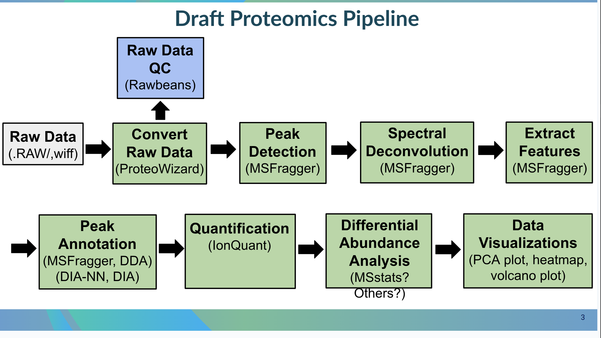

# GeneLab Proteomics Processing Workflow

> GeneLab, part of [NASA's Open Science Data Repository (OSDR)](https://www.nasa.gov/osdr), has wrapped each step of the Proteomics processing pipeline ([PPP](https://github.com/nasa/GeneLab_Data_Processing/tree/master/Proteomics)) into a Nextflow workflow with validation and verification of output files built in after each step. This repository contains the Nextflow workflow code (NF_Proteomics) along with instructions for installation and usage. Exact workflow run info and PPP version used to process specific datasets that have been released are available in the *nextflow_processing_info.txt file on the [Open Science Data Repository (OSDR)](https://osdr.nasa.gov/bio/repo/), which can be found under 'Files' -> 'GeneLab Processed Proteomics Files' -> 'Supplemental Materials'.

> **Click links below to show/hide workflow diagrams**

<!-- <details>
<summary>NF_Proteomics workflow for GL-DPPD-[TMT10]</summary>
<p align="center">
<a href="images/draft_pipeline.png"></a>
</p>
</details>

<details>
<summary>NF_Proteomics workflow for GL-DPPD-[TMT16]</summary>
<p align="center">
<a href="images/draft_pipeline.png"></a>
</p>
</details>

<details>
<summary>NF_Proteomics workflow for GL-DPPD-[TMT16-phospho]</summary>
<p align="center">
<a href="images/draft_pipeline.png"></a>
</p>
</details> -->

<details open>
<summary>NF_Proteomics workflow</summary>
<p align="center">
<a href="images/draft_pipeline.png"></a>
</p>
</details>

## General Workflow Information

### Implementation Tools

The current GeneLab Proteomics processing pipelines (PPP) for label-free quantification with match-between-runs ([GL-DPPD-[LFQ-MBR]](../../Pipeline_GL-DPPD-[LFQ-MBR]_Versions/GL-DPPD-[LFQ-MBR].md)), TMT10 ([GL-DPPD-[TMT10]](../../Pipeline_GL-DPPD-[TMT10]_Versions/GL-DPPD-[TMT10].md)), TMT16 ([GL-DPPD-[TMT16]](../../Pipeline_GL-DPPD-[TMT16]_Versions/GL-DPPD-[TMT16].md)), and TMT16 phosphoproteomics ([GL-DPPD-[TMT16-phospho]](../../Pipeline_GL-DPPD-[TMT16-phospho]_Versions/GL-DPPD-[TMT16-phospho].md)) are implemented as a single [Nextflow](https://nextflow.io/) DSL2 workflow that utilizes [Singularity](https://docs.sylabs.io/guides/3.10/user-guide/introduction.html) to run all tools in containers. This workflow (NF_Proteomics) is run using the command line interface (CLI) of any unix-based system. While knowledge of creating workflows in Nextflow is not required to run the workflow as is, [the Nextflow documentation](https://nextflow.io/docs/latest/index.html) is a useful resource for users who want to modify and/or extend this workflow.  

<br> 

# NF_Proteomics Workflow & Subworkflows

### NF_Proteomics Resource Requirements

The table below details the default maximum resource allocations for individual Nextflow processes.

| Workflow Type | Default CPU Cores | Default Memory |
|---------------|-------------------|----------------|
| All workflows | 8                 | 64 GB          |

> **Note:** These per-process resource allocations are defaults. They can be adjusted by modifying `cpus` and `memory` directives in the configuration file: [`nextflow.config`](workflow_code/nextflow.config).

<br>

---
## Utilizing the Workflow

1. [Install Nextflow and Singularity](#1-install-nextflow-and-singularity)  
   1a. [Install Nextflow](#1a-install-nextflow)  
   1b. [Install Singularity](#1b-install-singularity)
2. [Download the Workflow Files](#2-download-the-workflow-files)  
3. [Fetch Singularity Images](#3-fetch-singularity-images)  
4. [Run the Workflow](#4-run-the-workflow)  
   4a. [Run the LFQ-MBR workflow on a GeneLab Proteomics dataset](#4a-run-the-lfq-mbr-workflow-on-a-genelab-proteomics-dataset)  
   4b. [Run the LFQ-MBR workflow with custom reference proteome](#4b-run-the-lfq-mbr-workflow-with-custom-reference-proteome)  
   4c. [Run the LFQ-MBR workflow on a custom dataset](#4c-run-the-lfq-mbr-workflow-on-a-custom-dataset)  
   4d. [Run the LFQ-MBR workflow with custom FragPipe workflow config](#4d-run-the-lfq-mbr-workflow-with-custom-fragpipe-workflow-config)  
   4e. [Run the TMT10 workflow on a custom dataset](#4e-run-the-tmt10-workflow-on-a-custom-dataset)  
5. [Additional Output Files](#5-additional-output-files)  
<br>

---

### 1. Install Nextflow and Singularity 

#### 1a. Install Nextflow

Nextflow can be installed either through [Anaconda](https://anaconda.org/bioconda/nextflow) or as documented on the [Nextflow documentation page](https://www.nextflow.io/docs/latest/getstarted.html).

> Note: If you want to install Anaconda, we recommend installing a Miniforge version appropriate for your system, as documented on the [conda-forge website](https://conda-forge.org/download/), where you can find basic binaries for most systems. More detailed miniforge documentation is available in the [miniforge github repository](https://github.com/conda-forge/miniforge).
> 
> Once conda is installed on your system, you can install the latest version of Nextflow by running the following commands:
> 
> ```bash
> conda install -c bioconda nextflow
> nextflow self-update
> ```

<br>

#### 1b. Install Singularity

Singularity is a container platform that allows usage of containerized software. This enables the GeneLab PPP workflow to retrieve and use all software required for processing without the need to install the software directly on the user's system.

We recommend installing Singularity on a system wide level as per the associated [documentation](https://docs.sylabs.io/guides/3.10/admin-guide/admin_quickstart.html).

> Note: Singularity is also available through [Anaconda](https://anaconda.org/conda-forge/singularity).

> Note: Alternatively, Docker can be used in place of Singularity. See the [Docker CE installation documentation](https://docs.docker.com/engine/install/).

<br>

---

### 2. Download the Workflow Files

All files required for utilizing the NF_Proteomics GeneLab workflow for processing Proteomics data are in the [workflow_code](workflow_code) directory. To get a 
copy of latest NF_Proteomics version on to your system, the code can be downloaded as a zip file from the release page then unzipped after downloading by running the following commands: 

```bash
wget https://github.com/nasa/GeneLab_Proteomics_Workflow/releases/download/NF_PPP_1.0.0/NF_PPP_1.0.0.zip

unzip NF_PPP_1.0.0.zip
```

<br>

---

### 3. Fetch Singularity Images

Although Nextflow can fetch Singularity images from a url, doing so may cause issues as detailed [here](https://github.com/nextflow-io/nextflow/issues/1210).

To avoid this issue, run the following command to fetch the Singularity images prior to running the NF_PPP workflow:
> Note: This command should be run in the location containing the `NF_PPP_1.0.0` directory that was downloaded in [step 2](#2-download-the-workflow-files) above. Depending on your network speed, fetching the images will take ~20 minutes. Approximately 8GB of RAM is needed to download and build the Singularity images.

```bash
bash NF_PPP_1.0.0/bin/prepull_singularity.sh NF_PPP_1.0.0/config/by_docker_image.config
```


Once complete, a `singularity` folder containing the Singularity images will be created. Run the following command to export this folder as a Nextflow configuration environment variable to ensure Nextflow can locate the fetched images:

```bash
export NXF_SINGULARITY_CACHEDIR=$(pwd)/singularity
```

<br>

---

### 4. Run the Workflow

While in the location containing the `NF_PPP_1.0.0` directory that was downloaded in [step 2](#2-download-the-workflow-files), you are now able to run the workflow.

Below are examples of how to run the NF_Proteomics workflow:
> Note: Nextflow commands use both single hyphen arguments (e.g. -help) that denote general nextflow arguments and double hyphen arguments (e.g. --reference_version) that denote workflow specific parameters.  Take care to use the proper number of hyphens for each argument.

> Note: To use Docker instead of Singularity, use `-profile docker` in the Nextflow run command. Nextflow will automatically pull images as needed.

> Note: The `-resume` parameter can be used to resume a previously interrupted workflow from where it left off (see [Nextflow documentation](https://www.nextflow.io/docs/latest/getstarted.html#modify-and-resume)) or to restart the workflow from a specific point by changing relevant parameters, which will re-execute that process and all downstream affected processes.

<br>

#### 4a. Run the LFQ-MBR workflow on a GeneLab Proteomics dataset

```bash
nextflow run NF_PPP_1.0.0/main.nf \ 
   -profile singularity,local \
   --fragpipe_workflow LFQ-MBR \
   --accession OSD-581 \ 
   --uniprot_id UP001231189
```

<br>

#### 4b. Run the LFQ-MBR workflow with custom reference proteome

```bash
nextflow run NF_PPP_1.0.0/main.nf \ 
   -profile singularity,local \
   --fragpipe_workflow LFQ-MBR \
   --runsheet </path/to/runsheet> \ 
   --reference_proteome </path/to/fasta>
```

> Note: Specifications for creating a runsheet manually are described [here](examples/runsheet/README.md).

<br>

#### 4c. Run the LFQ-MBR workflow on a custom dataset

```bash
nextflow run NF_PPP_1.0.0/main.nf \ 
   -profile singularity,local \
   --fragpipe_workflow LFQ-MBR \
   --runsheet </path/to/runsheet> \ 
   --uniprot_id UP001231189
```

> Note: Specifications for creating a runsheet manually are described [here](examples/runsheet/README.md).

<br>

#### 4d. Run the LFQ-MBR workflow with custom FragPipe workflow config

```bash
nextflow run NF_PPP_1.0.0/main.nf \ 
   -profile singularity,local \
   --fragpipe_workflow LFQ-MBR \
   --fragpipe_workflow_config </path/to/LFQ-MBR_edited.workflow> \
   --runsheet </path/to/runsheet> \ 
   --uniprot_id UP001231189
```

> Note: Use `--fragpipe_workflow_config` to override the default FragPipe workflow with a custom `.workflow` file. For example, `LFQ-MBR_edited.workflow` may have `msfragger.fragment_mass_tolerance=300` set (from the default value of 20).

<br>

#### 4e. Run the TMT10 workflow on a custom dataset

```bash
nextflow run NF_PPP_1.0.0/main.nf \ 
   -profile singularity,local \
   --data_sheet </path/to/data_sheet.csv> \ 
   --sample_sheet </path/to/sample_sheet.csv> \
   --fragpipe_workflow TMT10 \
   --uniprot_id UP000000803
```

> Note: TMT workflows require both a data sheet and a sample sheet. See [runsheet examples](examples/runsheet/README.md) for OSD-514 TMT10 formats. Use `TMT10`, `TMT16`, or `TMT16-phospho` for `--fragpipe_workflow` as appropriate.

<br>

#### Required Parameters For All Approaches:

* `NF_PPP_1.0.0/main.nf` - Instructs Nextflow to run the NF_Proteomics workflow 

* `-profile` - Specifies the configuration profile(s) to load, `singularity` instructs Nextflow to setup and use singularity for all software called in the workflow; use `local` for local execution ([local.config](workflow_code/conf/local.config)) or `slurm` for SLURM cluster execution ([slurm.config](workflow_code/conf/slurm.config))
  > Note: The output directory will be named `GLDS-#` when using a OSD or GLDS accession as input, or `results` when running the workflow with only a runsheet as input.


<br>

**Additional Required Parameters For [4a](#4a-run-the-lfq-mbr-workflow-on-a-genelab-proteomics-dataset):**

* `--accession` - The OSD or GLDS ID for the dataset to be processed, eg. `GLDS-194` or `OSD-194`

* `--uniprot_id` - UniProt proteome ID(s) (e.g., `UP001231189`). The workflow will download the proteome FASTA from UniProt.

<br>

**Additional Required Parameters For [4b](#4b-run-the-lfq-mbr-workflow-with-custom-reference-proteome):**

* `--runsheet` - Path to the runsheet file containing sample metadata and input file paths

* `--reference_proteome` - Path to a custom reference proteome FASTA file

<br>

**Additional Required Parameters For [4c](#4c-run-the-lfq-mbr-workflow-on-a-custom-dataset):**

* `--runsheet` - Path to a local runsheet file containing sample metadata and input file paths

* `--uniprot_id` - UniProt proteome ID (e.g., `UP001231189`). The workflow will download the proteome FASTA from UniProt.

<br>

**Additional Required Parameters For [4e](#4e-run-the-tmt10-workflow-on-a-custom-dataset):**

* `--sample_sheet` - Path to the TMT sample sheet containing sample level metadata and sample-to-channel mapping

* `--data_sheet` - Path to the TMT data sheet containing the mzML files for each plex

* `--fragpipe_workflow` - TMT workflow mode: `TMT10`, `TMT16`, or `TMT16-phospho`

* `--uniprot_id` - UniProt proteome ID (e.g., `UP000000803` for *Drosophila melanogaster*). The workflow will download the proteome FASTA from UniProt.

<br>

**Additional [Optional] Parameters For All Approaches**

> *Note: See `nextflow run NF_PPP_1.0.0/main.nf --help` and [Nextflow's CLI run command documentation](https://nextflow.io/docs/latest/cli.html#run) for more options and details on how to run Nextflow.*

* `--isa_archive` - Path or URL to ISA.zip. If omitted, pulled from OSDR when runsheet (LFQ) or data_sheet+sample_sheet (TMT) are missing (type: string, default: null)
* `--fragpipe_tools` - Path to FragPipe tools dir (type: string, default: conf/tools)
* `--fragpipe_workflow_config` - Path to custom workflow config (type: string, default: null)
* `--philosopher_reviewed` - Download only reviewed (Swiss-Prot) entries when using `uniprot_id` (type: boolean, default: true)
* `--philosopher_isoforms` - Include protein isoforms in database when using `uniprot_id` (type: boolean, default: true)
* `--philosopher_enzyme` - Enzyme for digestion: trypsin, lys_c, lys_n, glu_c, chymotrypsin (type: string, default: "trypsin")
* `--philosopher_spike_in` - Path to spike-in FASTA file to add to database (e.g., iRT peptides) (type: string, default: null)
* `--philosopher_contaminants` - Add common contaminant proteins (type: boolean, default: true)
* `--philosopher_contaminants_prefix` - Prefix for contaminant sequences when pulling from UniProt (type: string, default: null)
* `--philosopher_decoy_prefix` - Prefix for decoy sequences (type: string, default: "rev_")
* `--philosopher_decoys` - Add decoy sequences to database (type: boolean, default: true)
* `--fp_analyst_levels` - Comma-separated levels: protein, peptide, gene, site. Default: protein,peptide (LFQ) or protein,gene,peptide,site (TMT) when null (type: string, default: null)
* `--fp_analyst_tmt_quant_type` - TMT only: abundance or ratio (type: string, default: "abundance")
* `--fp_analyst_lfq_type` - LFQ column type: Intensity, MaxLFQ, or Spectral Count. raw_matrix/imputed_matrix assay: log2 for Intensity/MaxLFQ; raw for Spectral Count (type: string, default: "Intensity")
* `--fp_analyst_normalization_method` - Normalization applied before DE: none, MD (median), GN (global) (type: string, default: "none")
<!-- vsn (Variance Stabilizing) is also available for LFQ/DIA only; not for TMT or Spectral Count -->
* `--fp_analyst_imputation_type` - Imputation: none, Perseus-type, knn, MLE, min, zero, bpca, QRILC, MinDet, MinProb, nbavg, mixed (type: string, default: "Perseus-type")
* `--fp_analyst_imputation_shift` - Perseus-type imputation shift in SD units (type: float, default: 1.8)
* `--fp_analyst_imputation_scale` - Perseus-type imputation scale factor (type: float, default: 0.3)
* `--fp_analyst_de_alpha` - Adjusted p-value threshold for DE significance (type: float, default: 0.05)
* `--fp_analyst_de_lfc` - Log2 fold change threshold for DE significance (type: float, default: 1.0)
* `--fp_analyst_de_fdr` - FDR correction: 'Benjamini Hochberg' or 'Local and tail area-based' (type: string, default: "Benjamini Hochberg")
* `--fp_analyst_enrichment_database` - Enrichment databases, e.g. Hallmark, GO_Biological_Process_2021, KEGG_2021_Human, Reactome_2022. '' = skip (type: string, default: "Hallmark,GO_Biological_Process_2021")
* `--fp_analyst_enrichment_direction` - Enrichment direction(s): Up, Down, or comma-separated (e.g. Up,Down) (type: string, default: "Up,Down")
* `--fp_analyst_gsea_database` - GSEA databases: Hallmark, GO_Biological_Process_2021, GO_Cellular_Component_2021, GO_Molecular_Function_2021, KEGG_2021_Human. Protein/gene/site only. '' = skip (type: string, default: "Hallmark,GO_Biological_Process_2021")
* `--fp_analyst_protein_feature_list` - Comma-separated protein IDs for feature plots. Empty = use top_n_protein (type: string, default: null)
* `--fp_analyst_gene_feature_list` - Comma-separated gene names for feature plots. Empty = use top_n_gene (type: string, default: null)
* `--fp_analyst_peptide_feature_list` - Comma-separated peptide IDs for feature plots. Empty = use top_n_peptide (type: string, default: null)
* `--fp_analyst_site_feature_list` - Comma-separated site IDs for feature plots. Empty = use top_n_site (type: string, default: null)
* `--fp_analyst_top_n_protein` - Plot top N most variable proteins when `fp_analyst_protein_feature_list` is empty. 0 = skip (type: integer, default: 10)
* `--fp_analyst_top_n_gene` - Plot top N most variable genes when `fp_analyst_gene_feature_list` is empty. 0 = skip (type: integer, default: 10)
* `--fp_analyst_top_n_peptide` - Plot top N most variable peptides when `fp_analyst_peptide_feature_list` is empty. 0 = skip (type: integer, default: 10)
* `--fp_analyst_top_n_site` - Plot top N most variable sites when `fp_analyst_site_feature_list` is empty. 0 = skip (type: integer, default: 10)
* `--fp_analyst_qc_plot_data` - Data for PCA, correlation, etc.: imputed or nonimputed (type: string, default: "nonimputed")
* `--fp_analyst_sample_cvs_full_range` - Sample CVs: full range or 0-1 (type: boolean, default: false)
* `--fp_analyst_volcano_display_names` - Display names on significant volcano points (type: boolean, default: true)
* `--fp_analyst_volcano_show_gene` - Show gene names (true) or protein/peptide ID (false) in volcano (type: boolean, default: true)
* `--multiqc_config` - Path to MultiQC config (type: string, default: conf/multiqc.config)
* `--reference_table` - Path or URL to GeneLab Reference Annotations table for gene annotations lookup (type: string, default: [GL-DPPD-7110-A_annotations.csv](https://raw.githubusercontent.com/nasa/GeneLab_Data_Processing/refs/heads/master/GeneLab_Reference_Annotations/Pipeline_GL-DPPD-7110_Versions/GL-DPPD-7110-A/GL-DPPD-7110-A_annotations.csv))
* `--gene_annotations_file` - Override: direct path/URL to gene annotations table (type: string, default: null)
* `--assay_suffix` - Suffix to append to output filenames (type: string, default: "_GLProteomics")
* `--output_dir` - Parent path for workflow outputs (type: string, default: ".")
* `--results_dir` - Results directory name. If null, uses "results" (params.output_dir/results/) (type: string, default: null)
* `--publish_dir_mode` - Published outputs: copy, link, or symlink (type: string, default: "link")
* `--errorStrategy` - Error handling strategy for Nextflow processes. Use "ignore" to allow workflow to continue on process failure (type: string, default: "terminate")

<br>

---

### 5. Additional Output Files

> Note: The outputs from the Proteomics Processing Pipeline are documented in the [GL-DPPD-[LFQ-MBR]](../../Pipeline_GL-DPPD-[LFQ-MBR]_Versions/GL-DPPD-[LFQ-MBR].md), [GL-DPPD-[TMT10]](../../Pipeline_GL-DPPD-[TMT10]_Versions/GL-DPPD-[TMT10].md), [GL-DPPD-[TMT16]](../../Pipeline_GL-DPPD-[TMT16]_Versions/GL-DPPD-[TMT16].md), and [GL-DPPD-[TMT16-phospho]](../../Pipeline_GL-DPPD-[TMT16-phospho]_Versions/GL-DPPD-[TMT16-phospho].md) processing protocols.

**Processing Metadata**

   - Output:
     - Metadata/\*_proteomics_v1*_sheet.csv (table containing metadata required for processing, including the raw data files location)
     - Metadata/*-ISA.zip (the ISA archive of the OSD datasets to be processed, downloaded from the OSDR)
   
**Processing Information Archive**

   - Output:
     - GeneLab/processing_info_GLProteomics.zip (Archive containing workflow execution metadata)
       - processing_info/samples.txt (single column list of all sample names in the dataset)
       - processing_info/nextflow_log_GLProteomics.txt (Nextflow execution logs captured via `nextflow log`)
       - processing_info/nextflow_run_command_GLProteomics.txt (Exact command line used to initiate the workflow)

**Software Versions Table**

   - Output:
     - GeneLab/software_versions_GLProteomics.md (markdown table of software versions used in the workflow)

<br>

Standard Nextflow resource usage logs are also produced as follows:
> Further details about these logs can also found within [this Nextflow documentation page](https://www.nextflow.io/docs/latest/tracing.html#execution-report).

**Nextflow Resource Usage Logs**

   - Output:
     - nextflow_info/execution_report_{timestamp}.html (an html report that includes metrics about the workflow execution including computational resources and exact workflow process commands)
     - nextflow_info/execution_timeline_{timestamp}.html (an html timeline for all processes executed in the workflow)
     - nextflow_info/execution_trace_{timestamp}.txt (an execution tracing file that contains information about each process executed in the workflow, including: submission time, start time, completion time, cpu and memory used, machine-readable output)
     - nextflow_info/pipeline_dag_{timestamp}.html (a visualization of the workflow process DAG)

<br>

---

# Licenses

The software for the Proteomics pipeline and workflow is released under the [NASA Open Source Agreement (NOSA) Version 1.3](License/RNA_Sequencing_NOSA_License.pdf).


### 3rd Party Software Licenses

Licenses for the 3rd party open source software utilized in the Proteomics pipeline and workflow can be found in the [3rd_Party_Licenses sub-directory](License/3rd_Party_Licenses). 

<br>

---

## Notices

Copyright © 2026 United States Government as represented by the Administrator of the National Aeronautics and Space Administration.  All Rights Reserved. 

### Disclaimers

No Warranty: THE SUBJECT SOFTWARE IS PROVIDED "AS IS" WITHOUT ANY WARRANTY OF ANY KIND, EITHER EXPRESSED, IMPLIED, OR STATUTORY, INCLUDING, BUT NOT LIMITED TO, ANY WARRANTY THAT THE SUBJECT SOFTWARE WILL CONFORM TO SPECIFICATIONS, ANY IMPLIED WARRANTIES OF MERCHANTABILITY, FITNESS FOR A PARTICULAR PURPOSE, OR FREEDOM FROM INFRINGEMENT, ANY WARRANTY THAT THE SUBJECT SOFTWARE WILL BE ERROR FREE, OR ANY WARRANTY THAT DOCUMENTATION, IF PROVIDED, WILL CONFORM TO THE SUBJECT SOFTWARE. THIS AGREEMENT DOES NOT, IN ANY MANNER, CONSTITUTE AN ENDORSEMENT BY GOVERNMENT AGENCY OR ANY PRIOR RECIPIENT OF ANY RESULTS, RESULTING DESIGNS, HARDWARE, SOFTWARE PRODUCTS OR ANY OTHER APPLICATIONS RESULTING FROM USE OF THE SUBJECT SOFTWARE.  FURTHER, GOVERNMENT AGENCY DISCLAIMS ALL WARRANTIES AND LIABILITIES REGARDING THIRD-PARTY SOFTWARE, IF PRESENT IN THE ORIGINAL SOFTWARE, AND DISTRIBUTES IT "AS IS."

Waiver and Indemnity:  RECIPIENT AGREES TO WAIVE ANY AND ALL CLAIMS AGAINST THE UNITED STATES GOVERNMENT, ITS CONTRACTORS AND SUBCONTRACTORS, AS WELL AS ANY PRIOR RECIPIENT.  IF RECIPIENT'S USE OF THE SUBJECT SOFTWARE RESULTS IN ANY LIABILITIES, DEMANDS, DAMAGES, EXPENSES OR LOSSES ARISING FROM SUCH USE, INCLUDING ANY DAMAGES FROM PRODUCTS BASED ON, OR RESULTING FROM, RECIPIENT'S USE OF THE SUBJECT SOFTWARE, RECIPIENT SHALL INDEMNIFY AND HOLD HARMLESS THE UNITED STATES GOVERNMENT, ITS CONTRACTORS AND SUBCONTRACTORS, AS WELL AS ANY PRIOR RECIPIENT, TO THE EXTENT PERMITTED BY LAW.  RECIPIENT'S SOLE REMEDY FOR ANY SUCH MATTER SHALL BE THE IMMEDIATE, UNILATERAL TERMINATION OF THIS AGREEMENT. 

The GeneLab Proteomics Processing Pipeline and Workflow software also makes use of 3rd party Open Source software, released under the licenses indicated above.  A complete listing of 3rd Party software notices and licenses made use of in the GeneLab Proteomics Processing Pipeline and Workflow can be found in the [3rd Party Licenses README.md](License/3rd_Party_Licenses/README.md) file. 

<br>

---
**Developed by:**  
A

**Maintained by:**  
B

**Contributors:**  
C
